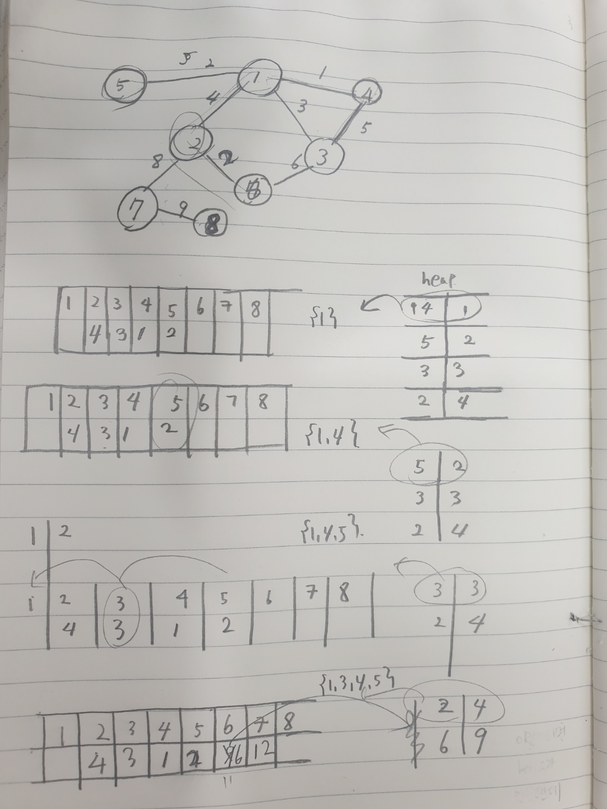

# 1. 문제의 핵심
- 다익스트라
# 2. 알고리즘
## 2.0 사용 자료구조
- 계산 완료된 것: set
- 최소 거리: heap, list
- 갱신된 거리 저장: list
## 2.1 다익스트라 알고리즘
</img>

1. 초기는 어디가 최소 거리인지 계산이 안되어있으므로 무한대로 계산한다.
2. 시작 노드와 연결된 노드를 순회하면서 아래를 반복한다.
    - 시작노드는 거리가 0으로 초기화, 계산완료된 노드로 간주
    - 시작노드와 연결된 새로 연결된 거리 계산
        - 새로 계산된 거리: 시작노드 거리 + 시작노드-연결된노드 거리
        - 새로 계산된 거리 < 현재 거리이면 거리 갱신
3. 계산이 끝난후 **가장 짧은거리**를 다음시작노드로 선택한다.
4. 모든 노드가 계산이 완료될때까지 2, 3번을 반복한다.

## 2.2 전체 알고리즘
- 1번 노드부터 끝노드까지 최소 거리 구한다.
    - 1번노드를 시작노드로 dijskstra를 실행한다.
- 반드시 거쳐가는 노드들을 시작 노드로 최소거리를 구한다.
    - v1을 시작노드로 dijkstra를 실행한다.
    - v2를 시작노드로 dijkstra를 실행한다. 
- 완료된 다익스트라를 계산한다.
    - 경우의 수 1 
        - 시작노드-v1에서의 최소거리 +
        - v1-v2에서의 최소거리 +
        - v2-end에서의 최소거리
    - 경우의 수 2
        - 시작노드-v2에서의 최소 거리 +
        - v2-v1에서의 최소거리 +
        - v1-end에서의 최소거리
- 두개의 최소거리중 가장 작은것을골라 결과출력한다.
## 3. 알아야할 Code Snippet
1.1 dijkstra
```python
def get_min_dist(graph, num_node, start, except_node = None):
    arr_min_dist = [float('inf')]*(num_node+1) #list comprehesion: [math.inf for _ in range(v + 1)]
    min_dist = []

    arr_min_dist[start] = 0  # 갱신용 최소 거리
    checked_node = set()  # set
    heappush(min_dist, (0, start))  # 가장 최소거리

    while len(min_dist) > 0:  # 힙이 0이 될때까지
        _, node = heappop(min_dist) 
        if node in checked_node:  # 이미 계산이 완료된 노드라면 (heap 안에 똑같은 노드가 여러개 있을수 있으므로)
            continue  # 지나친다.
        checked_node.add(node)  # 그렇지 않으면 set에 node를 넣는다.
        for connected_node, connected_dist in graph[node]:  # 연결된 노드 그래프를 순회하면서 
            new_dist = connected_dist + arr_min_dist[node]  # 새거리를 계산 새거리: 현재 노드의 최소거리 + 연결된 거리
            if new_dist < arr_min_dist[connected_node]:  # 갱신된 거리가 기존 connected_node에 저장된 거리보다 작다면 
                arr_min_dist[connected_node] = new_dist  #갱신시켜주고
                heappush(min_dist, (new_dist, connected_node))  # heappush를 한다.
    return arr_min_dist
```
1.2 최소거리 
```python
    candid_result_1 = arr_min_start[v1] + arr_min_v1[v2] + arr_min_v2[num_node]
    candid_result_2 = arr_min_start[v2] + arr_min_v2[v1] + arr_min_v1[num_node]
```
# 3. 시간 복잡도
- O(3edge*node)
    - start에서 dijkstra, v1, v2에서 diskstra(총 3번)
    - node가 edge만큼 순회하므로
# 4. 빨리푼사람 코드(출처: 백준 아이디-jiyolla)
- list comprehension
- dijsktra를 두번만에 계산함
```
    1. 1 -> v_1 -> v_2 -> v와 1 -> v_2 -> v_1 -> v중에서 더 작은 것을 골라야 되는데
    방향이 없는 그래프이기에, 1 -> v_1과 v_1 -> 1이 같다.
    2. dijkstra를 최소한으로 돌리기 위해서, 시작 노드의 수를 최대한 줄이는 것이 좋다.
        - v_1 -> 1, v_1 -> v_2, v_1 -> v
        - v_2 -> 1, v_2 -> v 
```
```python
    d_v1_1, d_v1_v2, d_v1_v = dijkstra(v_1, 1, v_2, v)
    d_v2_1, d_v2_v = dijkstra(v_2, 1, v)
```
# 4. 복기 할것
- 나는 맨처음에 다시 돌아올 수 있어도 마지막 곳에서는 계산을 제외했어야한다고 생각함 하지만 계산되었음
- 또한 dijkstra에서 모든 거리중 최소 거리가 아닌, 현 노드에서 계산된 최소거리로 생각했었음 