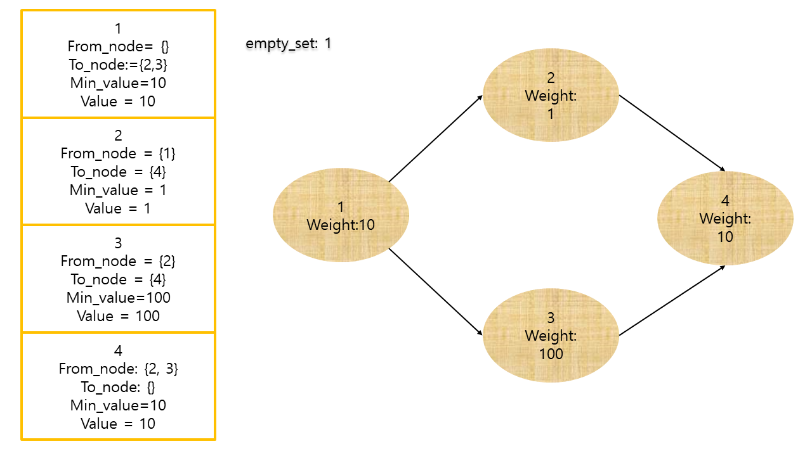
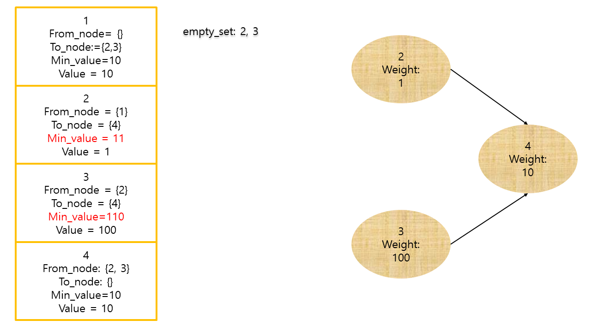
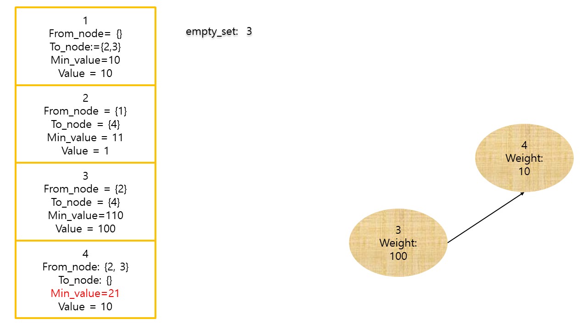
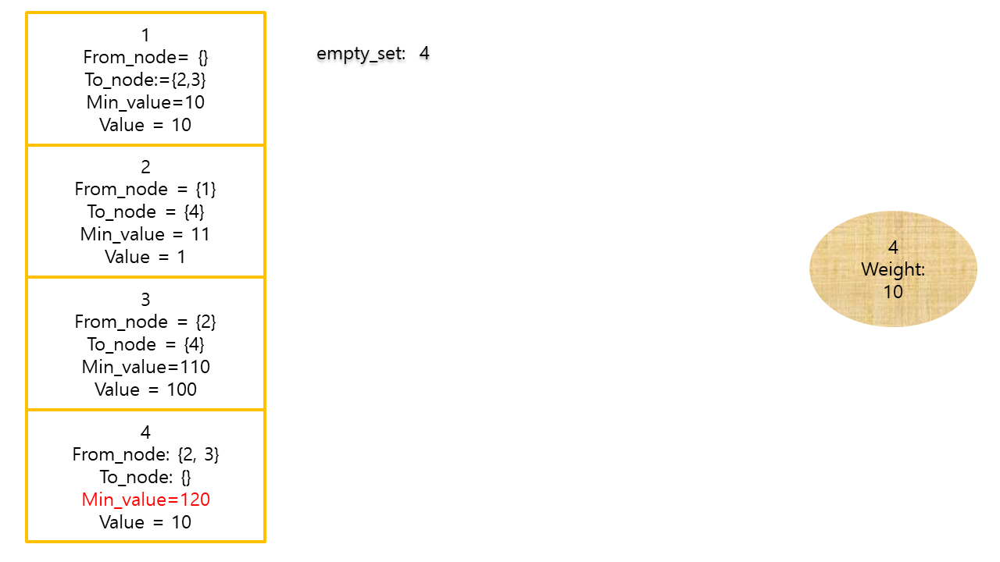

# 1. 문제의 핵심
-  위상정렬
# 2. 풀이 알고리즘
1. topological 정렬용 그래프 제작
2. from_node가 빈것을 emtpy_set에 넣음
3. emtpty_set에서 하나 뽑음
    - 그 노드의 to node를 순회함
    - to_node의 Min_value와 현 노드의 value의 합이 to_node value보다 크다면 to_node의 Min_value 갱신
    (N개가 동시 연결된경우 모두 끝날때까지 기다려야한다.)
    - to_node에서 원소하나 제거
    - to_node중 from_node가 0인건 emtpy_set 에 넣음
    - 만약 현재 노드가 목표노드와 동일하면 반복문 종료


</img>

</img>
</img>
</img>

## 2.0 사용 자료구조
1. 위상정렬에 사용할 노드: 클래스
    ```python 
       [Node(id, next_nodes, from_nodes,  min_value, value)]```

2. 위상정렬그래프: 리스트
3. from_node가 0인것: set
## 2.1 위상정렬 알고리즘
- 자신을 가리키는 것이 없는노드를 큐에 넣는다.
- 큐에 넣은것을 하나씩 빼면서 출력
- 자신이(A) 가리키는 노드들(B)을 순회한다.
    - 순회하는 노드(B)의 갯수를 제거한다
    - 그 노드(B)를 가리키는 노드갯수가 0개가되면
    - 큐에넣고 반복한다.

# 3. 시간 복잡도
- O(n): 모든 노드를 제거하면서 가야하므로
# 4. 빨리푼사람 코드 및 복기할것
- 계획한것대로 되어서 바로 풀림
- 빠르게 푼사람: 재귀를 사용함(백준아이디:shg9411)
```python
def solve():
    def dfs(u):
        if dp[u] != -1:
            return dp[u]
        m=max([dp[v] if dp[v]!=-1 else dfs(v) for v in adj[u]],default=0)
        dp[u]=m+t[u]
        return dp[u]
```

