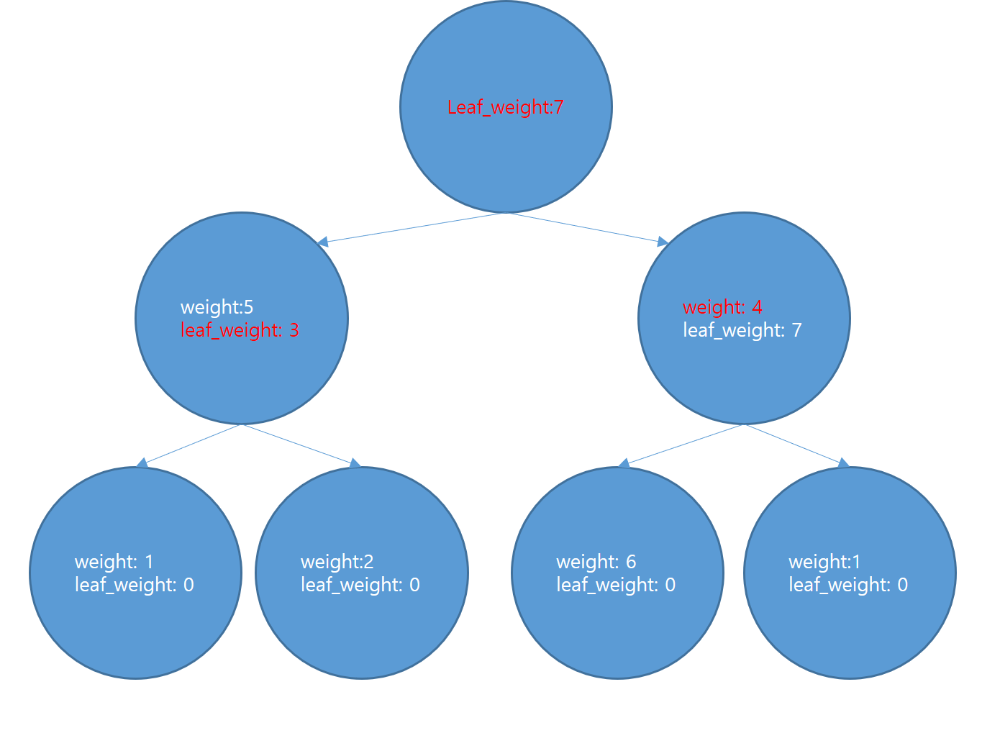

# 걸린시간
 - 2시간 50분
# 문제의 핵심
- 트리에서의 DP

# 알고리즘

- 양방향 그래프제작
- 양방향 그래프로 tree제작(make_tree)
- 리프노드가 0일때까지 아래를 반복(루트까지 올때까지)
    - 리프노드 집합에서 하나를 뽑음
    - 리프노드의 부모를 저장함
    - 만약 리프노드의 계산된 노드가 글로벌 처음 만들어졌던 리프노드가 아니고(0보다크고), 현재노드와 부모노드를 자른 가중치보다 자식들을 자른 가중치가 더 작다면 
        - 부모노드의 가중치에 자식노드의 계산된 가중치를 넣어주고,
    - 그렇지 않다면
        - 현재 weight를 넣어준다.
    - 자식노드를 하나 제거해줌
    - 자식노드가 0이되면 리프노드가 되므로 리프노드에 넣어줌
- 계산이 완료되면 루트노드의 부모를 넣어준다.

# 자료구조
- Node:
    - 부모, 자식노드, 지금 가중치, 자식들로부터온 가중치
```python
class Node():
    def __init__(self):
        self.parent = 0
        self.num_child = 0
        self.weight = 0
        self.calc_weight = 0
```
# 코드 Snippet
```python
트리 만드는 코드 
def make_tree(bigraph, node_num):
    tree = [Node() for _ in range(node_num+1)]
    leaf_set = make_leafset(node_num)
    tree[1].parent = 0
    queue = deque()
    queue.appendleft(1)
    while queue:
        parent = queue.popleft()
        for child, dynamite in bigraph[parent]:
            if child != 1 and tree[child].parent == 0:
                tree[child].weight = dynamite
                tree[child].parent = parent
                tree[parent].num_child += 1
                if leaf_set.get(parent, None):
                    leaf_set.pop(parent)
                queue.appendleft(child)
    return tree, leaf_set
```
# 다른사람 풀이

# 복기할것
- 위상정렬과 비슷하게 문제를 풀었음
