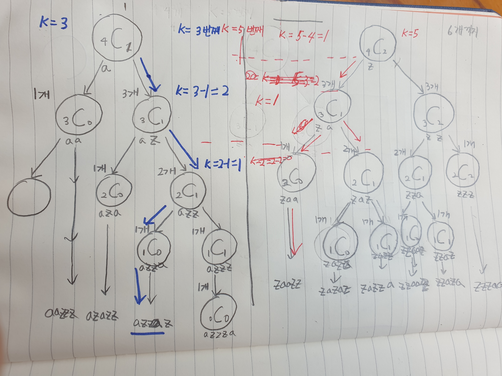

# 문제의 핵심
- 파스칼의 삼각형
- dynamic programming
# 문제 풀이 해설


- a를 소비한 후 남은 경우의 수로 생각한다.
    - 즉, 5자리중 2자리를 선택하는 경우의 수로 생각전환
- a는 2개 z는 3개인경우 전체경우의수: 5C2
    - 5C2 = 4C1 + 4C2 (파스칼의 삼각형)
        - a를 하나 소비한경우의수와 a를 하나 소비하지 않은 경우의 수로 나눌 수있다.
- a를 차례로 소비하는 경우의수로 파스칼의 삼각형으로 나누면 몇번째수인지 구할 수 있다.
- Ex)3번째를 찾는경우 (그림의 파란색)
    1. a를 소비한 4C1번째보다 숫자가 작으므로 앞자리는 a가 와야함
    2. a를 소비한 (3C1=1)보다는 숫자가 크므로 그다음숫자는 z를 써서 az(3C2)가 되어야한다.
    3. 그러면 앞의 숫자를 제외한 하여 K=3-1=2가 된다.(3C1보다 크므로)
    4. a를 소비한 (2C0=1)보다 K가 크므로 다음숫자는 z를 써서 azz(2C1)가 되어야한다. 이때, 2번째 다음숫자가 되어야하므로 K-1=2-1=1로 갱신된다.
    5. 다음 a를 소비한 (1C0=1)과 K가 같으므로
    다음숫자는 a를 써서 azza(1C0) 이되어야한다.
    6.R이 0이 되었으므로 반복은 멈춘다.
    7. 남은 숫자는 채워준다.

# Code Snippet
1. 파스칼의 삼각형만들기
```python
def make_pascal(N, M):
    graph = [[0] * (N+1) for _ in range (N+M+1)]
    if N == 0:
        return graph
    graph[0][0] = 1
    graph[1][1] = 1
    graph[1][0] = 1
    for i in range(2, N+M+1):
        for j in range(0, N+1):
            if j == 0 or j == i:
                graph[i][j] = 1
            else:
                num = graph[i-1][j] + graph[i-1][j-1]
                if num > 10**9:
                    num = 10**9
                graph[i][j] = num
    return graph
```
- 0행 0열은 1, 0열은 무조건 1 대각선도 무조건 1
- 나머지는 nCr = n-1Cr-1 + n-1Cr의 규칙에따라 채우기

2. 정답
```python
def calc(A, Z, C, K):
    N, R = A + Z, A
    data = []
    if A > 0:
        for _ in range(1, A+Z+1):
            print(f"N:{N}, R:{R}, K: {K}")
            if R <= 0 or N == R:
                continue
            if C[N-1][R-1] >= K:
                data.append('a')
                N, R = N-1, R-1
            else:
                K -= C[N-1][R-1]
                data.append('z')
                N, R = N-1, R

        left_a = R
        while left_a > 0:
            left_a -= 1
            data.append('a')

    while len(data) < A+Z:
        data.append('z')
    return ''.join(data)
```

# 복기할것
- 생각하기 어려웠던문제
- 이해하면 풀기는 쉬웠음