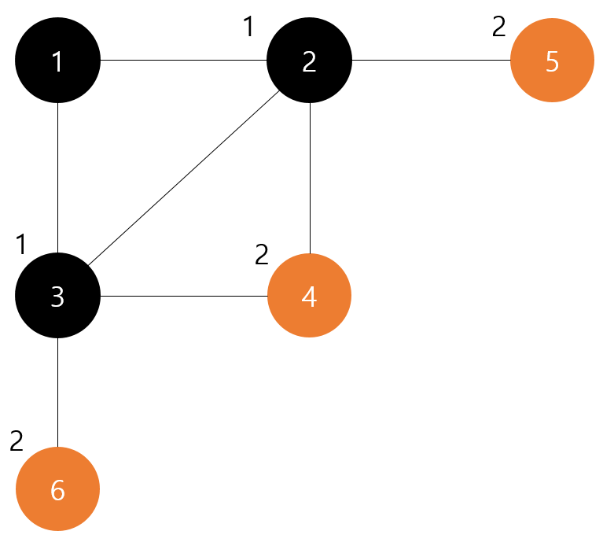

# **1. 문제의 핵심**
```
1. Graph 탐색
2. Graph
```
# **2. 사용 자료구조**
1. 그래프: 2차원 리스트( [[2, 1], [2, 0, 3, 4], [3, 1, 0], [2, 1], [1]])
    - 인덱스: 현재 vertex
    - 인덱스에 연결된 vertex 리스트들
2. 순회(큐): 데크
3. 방문 표시: 1차원 리스트
    - 인덱스: 현재 vertex
    - 값: 방문 유무
3. 정답: 1차원 리스트
    - 0번째 값: 가장 멀리떨어진 거리(가장 많은 간선 개수)
    - 1번재 값: 가장 멀리떨어진 거리를 가지는 vertex 개수

# **3. 알고리즘**


```
1. 입력리스트를 그래프로 바꿈
2. 큐에 시작 노드를 넣음
3. 큐가 빌때까지 반복함
    1) 큐에서 원소를 하나 뺌
    2) 원소와 인접한 노드들을 순회하면서 아래를 반복함
        - 방문하지 않았다면 방문 표시를 해줌
        - 방문하지 않은 노드를 큐에 넣어줌
        - 간선 개수를 하나 증가시켜줌
        - 정답의 간선 개수와 현재 간선 개수를 비교하여 현재 간선 개수가 큰경우 정답으로 갱신
        - 현재 간선개수와 같은경우 현재 간선 개수를 가지는 vertex개수를 하나 증가시킴
```

# **4. Code Snippet**
1. 그래프 탐색하는 코드
```python
while queue:
        vertex = queue.popleft()
        for adjacement_vertex in graph[vertex]:
            if not visited[adjacement_vertex]:
                visited[adjacement_vertex] = True
                queue.append(adjacement_vertex)
```

# **5. 복기할것 및 실수한것**
- 현재 정답이 커서 정답을 새롭게 갱신하는경우 max_value(정답)의 모든 값을 갱신 시켜주어야한다.


<detail>
<details>
<summary>전체 코드</summary>
<div markdown="1">

# **6. 소스코드**
```python
from collections import deque

def make_graph(n, edge):
    graph = [list() for _ in range(n)]
    for vertexes in edge:
        graph[vertexes[0]-1].append(vertexes[1]-1)
        graph[vertexes[1]-1].append(vertexes[0]-1)
    return graph
        
def solution(n, edge):
    dijkstra = [0 for _ in range(n)]
    visited = [False for _ in range(n)]
    graph = make_graph(n, edge)
    queue = deque([0])
    visited[0] = True
    max_value = [0, 0] # 가장 멀리떨어진 거리와 갯수
    while queue:
        vertex = queue.popleft()
        for adjacement_vertex in graph[vertex]:
            if not visited[adjacement_vertex]:
                visited[adjacement_vertex] = True
                queue.append(adjacement_vertex)
                dijkstra[adjacement_vertex] = dijkstra[vertex] + 1
                
                if max_value[0] < dijkstra[adjacement_vertex]:
                    max_value[0] = dijkstra[adjacement_vertex]
                    max_value[1] = 1
                elif max_value[0] == dijkstra[adjacement_vertex]:
                    max_value[1] += 1
    return max_value[1]

```
</detail>