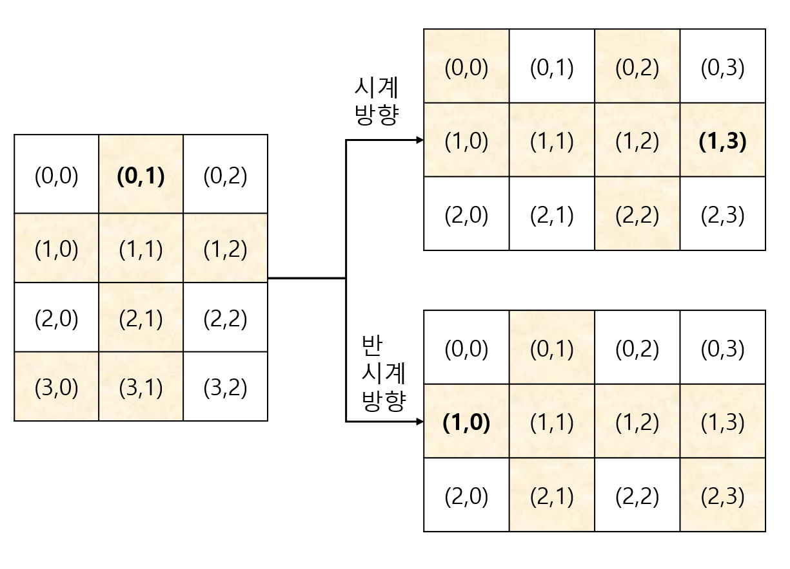

# 문제의 핵심
- 회전하는 코드만들기
- 시뮬레이션

# 자료구조
- 전체 보드(dragon_curve): 101행 101열로 선언한 2차원 배열
- 입력으로 주어진 정보로 드래곤 커브 계산을 위한 리스트: 1차원 배열에 튜플

# 알고리즘
- 각 입력에대한 아래를 반복해서 커브를 만듦
    - 0세대를 리스트에 담음 [(i, j), (i+a, i+b)]
    - N세대까지 아래를 반복
        - 원래 커브를 를 rotation한 새로운 리스트 생성
        - 새로운리스트의 끝을 맞춤
        - 새로운 리스트의 끝이 맞춰지면 앞부터 맨끝의 두번째전이 모두 달라지므로 0부터 len(new)-1까지 모두 추가
        - 보드에도 true로 갱신
            - original:      [(0, 0), (0, 1)]
            - new(rotation): [(0, 0), (1, 0)]
            - new_change:    [(-1,1), (0, 1)]
            - add original:  [(0, 0), (0, 1), ***(-1,1)***]
- 만들어진 dragon curve를 길이가 1인 점이 모두 True일 경우에대한 경우를 count후 반환

# Code Snippet
1. 시계방향으로 회전하는 코드
    ```python
    for i in range(len(curve)):
        # row의 자리에는 col이 들어감
        # col의 자리에는 2*전체row갯수 - row -1
        new.append((curve[i][1], (2**gen)-curve[i][0]-1))
    ``` 
2. 맨끝을 맞추는 코드
    ```python
        # 차이값 = 바꾸는목표좌표 - 현재좌표
        # 바꾸는좌표 = 차이값 + 현재좌표
        r = original_curve[-1][0] - new_curve[-1][0]
        c = original_curve[-1][1] - new_curve[-1][1]
        for i in range(len(new_curve)-2, -1, -1):
            change_r, change_c = new_curve[i][0]+r, new_curve[i][1]+c
            original_curve.append((change_r, change_c))
            dragon_curve[change_r][change_c] = 1
    ```

3. 복기할것
- 회전하는 코드를 생각하느라 오래걸림


```
0. 무조건 그 도형을 감싸는 직사각형 N,M을 회전한다 생각해야함(위 그림 참고)
1. 시계방향 회전(N:row갯수, M:col갯수라 가정)
    (r,c) -> (c, N-r-1)
    (0,1) -> (1, 4-1-1) -> (1,3)
2. 반시계방향 회전(N:row갯수, M:col갯수라 가정)
    (r,c) -> (M-c-1, r)
    (0,1) -> (3-1-1, 0) -> (1,0)
```
        
