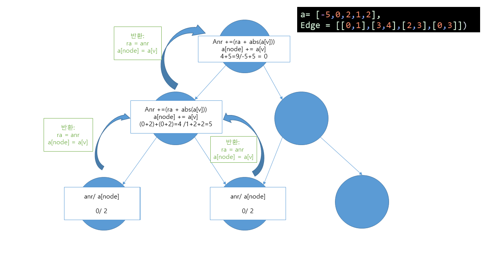

# 1. 왜 못풀었는가?
### 1.1. 내가 생각한 풀이 방식
- leaf node로부터 root 까지 하나씩 더해간다.
### 1.2.못푼 이유
- 구현을 못함: leaf node와 root까지 가는 법을 모름 
- 값을 두개를 반환하지 못함
- 어떤값을 반환하고 반환받은 값을 다루지 못함
- **사람들 구현 방법: 그냥 visited 씀**
# 1. 문제의 핵심
- 두개의 값 변경을 모두 반영하여 함수를 만들 수 있는가?
# 2. 알고리즘


-  leaf node의 반환값을 0과 현재 노드의 값을 잡음
-  leaf node가 아닌경우 
    - answer: 자식노드로부터 가져온 answer + abs(자식 노드 값)의 합
    - 현재 노드의 값: 자식노드값들의 합
- 부모인경우
    - 만약 부모노드의 (a[0]) 값이 0이 아니라면 합이 될 수 없으므로 -1 반환
# 3. code snippet
```python
def solve(a, tree, node, visited):
    if node!=0 and len(tree[node]) == 1:
        return 0, a[node]
    for i in tree[node]:
        if not visited[i]:
            ra, a[i] = solve(a, tree, i, visited)
            answer += (ra + abs(a[i]))
            a[node] += a[i]
    if node == 0:
        if a[node] != 0:
            return -1, a[node]
    return answer, a[node]
```
# 다른사람 풀이
1. bfs로 푼방법(./ref2.py): 다시 시도해 봄직함
2. dfs로 푼방법(./ref.py): 정말 참신하다... 재귀를 어디에 넣느냐에따라 값이 달라진다는것을 알았다.다음엔 이렇게 해봐야겠다.
# 2. 복기
- 부모를 어떻게 찾아야할지 모른다면 그냥 visited쓰면 됨!
- 반드시 leaf node를 반환값으로 생각하지 않아도됨
- 어떤값을 반환하고, 반환값을 어떻게 다룰것인지 생각해야함
- 작게 반환값과 반환값 다루는 방법을 생각해야함